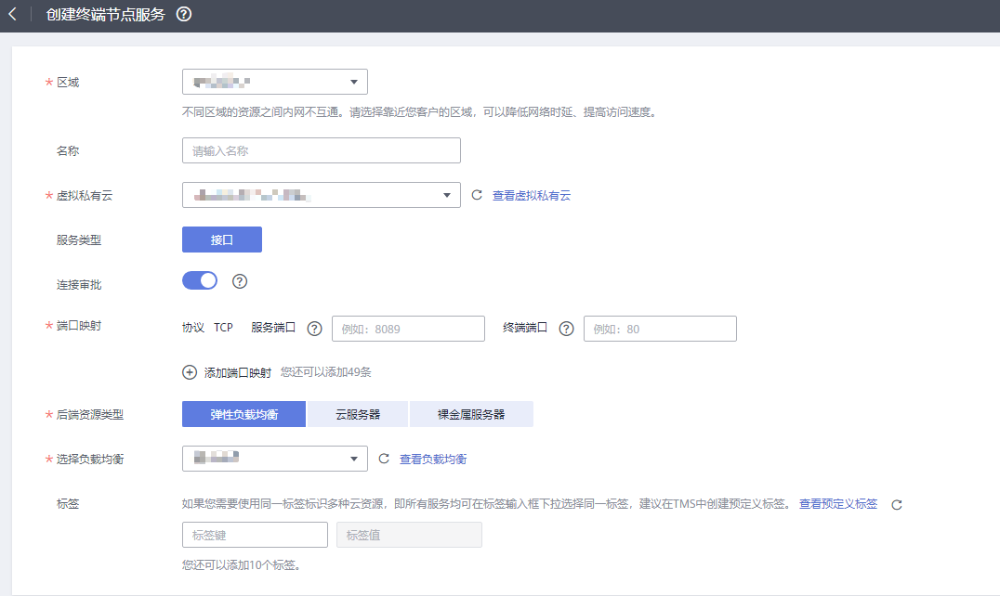

# 创建终端节点服务

## 操作场景

终端节点服务包括“网关”和“接口”两种类型。

-   网关：由系统配置的云服务类别的终端节点服务，用户无需创建，可直接使用。
-   接口：包括由系统配置的云服务类别的终端节点服务，以及由用户私有服务创建的终端节点服务。前者用户无需创建，可直接使用；后者需要用户自行创建。

本节介绍将用户私有服务创建为接口型终端节点服务的操作指导。

## 约束与限制

-   终端节点服务属于区域级资源，在创建时需要设置区域和项目。
-   每个租户支持创建20个终端节点服务。
-   支持创建为终端节点服务的用户私有服务包括：
    -   弹性负载均衡：适用于高访问量业务和对可靠性和容灾性要求较高的业务。
    -   云服务器：作为服务器使用。
    -   裸金属服务器：作为服务器使用。

-   一个终端节点服务仅支持对应一个后端资源实例。

## 前提条件

在同一VPC内，已经完成后端资源的创建。

## 操作步骤

1.  登录管理控制台。
2.  在管理控制台左上角单击“”图标，选择区域和项目。
3.  单击“服务列表”中的“网络 \> VPC终端节点”，进入“终端节点”页面。
4.  在左侧导航栏选择“VPC终端节点 \> 终端节点服务”，单击“创建终端节点服务”。

    进入“创建终端节点服务”页面。

    **图 1**  创建终端节点服务  
    

5.  根据界面提示配置参数，参数说明如[表1 终端节点服务配置参数](#zh-cn_topic_0132331143_table20351132821713)所示。

    **表 1**  终端节点服务配置参数

    
    <table><thead align="left"><tr id="zh-cn_topic_0132331143_row1835272821716"><th class="cellrowborder" valign="top" width="20.54%" id="mcps1.2.3.1.1">
参数

    </th>
    <th class="cellrowborder" valign="top" width="79.46%" id="mcps1.2.3.1.2">
说明

    </th>
    </tr>
    </thead>
    <tbody><tr id="zh-cn_topic_0132331143_row1354172831717"><td class="cellrowborder" valign="top" width="20.54%" headers="mcps1.2.3.1.1 ">
区域

    </td>
    <td class="cellrowborder" valign="top" width="79.46%" headers="mcps1.2.3.1.2 ">
终端节点服务所在区域。

    
不同区域的资源之间内网不互通。请选择靠近您的区域，可以降低网络时延、提高访问速度。

    </td>
    </tr>
    <tr id="zh-cn_topic_0132331143_row1350113217192"><td class="cellrowborder" valign="top" width="20.54%" headers="mcps1.2.3.1.1 ">
名称

    </td>
    <td class="cellrowborder" valign="top" width="79.46%" headers="mcps1.2.3.1.2 ">
可选参数。

    
终端节点服务的名称。

    
长度不超过16个字符，允许输入大小写字母、数字、下划线、中划线。

    <ul id="ul23391435674"><li>如果您不填写该参数，系统生成的终端节点服务的名称为{region}.{service_id}。</li><li>如果您填写该参数，系统生成的终端节点服务的名称为{region}.{Name}.{service_id}。</li></ul>
    </td>
    </tr>
    <tr id="zh-cn_topic_0132331143_row15357142816176"><td class="cellrowborder" valign="top" width="20.54%" headers="mcps1.2.3.1.1 ">
虚拟私有云

    </td>
    <td class="cellrowborder" valign="top" width="79.46%" headers="mcps1.2.3.1.2 ">
终端节点服务所属虚拟私有云。

    </td>
    </tr>
    <tr id="zh-cn_topic_0132331143_row1036162871712"><td class="cellrowborder" valign="top" width="20.54%" headers="mcps1.2.3.1.1 ">
服务类型

    </td>
    <td class="cellrowborder" valign="top" width="79.46%" headers="mcps1.2.3.1.2 ">
终端节点服务的类型，此处仅支持设置为“接口”类型。

    </td>
    </tr>
    <tr id="zh-cn_topic_0132331143_row13365028121710"><td class="cellrowborder" valign="top" width="20.54%" headers="mcps1.2.3.1.1 ">
连接审批

    </td>
    <td class="cellrowborder" valign="top" width="79.46%" headers="mcps1.2.3.1.2 ">
连接审批控制的是终端节点与终端节点服务的连接是否需要审批，审批权由终端节点服务控制。

    
可选择开启或关闭连接审批。

    
若选择开启连接审批，则与本终端节点服务连接的终端节点需要进行审批，详细内容请参见<a href="管理终端节点服务的连接审批.md">管理终端节点服务的连接审批</a>。

    </td>
    </tr>
    <tr id="zh-cn_topic_0132331143_row8367128141713"><td class="cellrowborder" valign="top" width="20.54%" headers="mcps1.2.3.1.1 ">
端口映射

    </td>
    <td class="cellrowborder" valign="top" width="79.46%" headers="mcps1.2.3.1.2 ">
终端节点服务与终端节点建立连接关系，进行通信，支持TCP协议。

    <ul id="ul5916165212133"><li>服务端口：终端节点服务绑定了后端资源，作为提供服务的端口。</li><li>终端端口：终端节点提供给用户，作为访问终端节点服务的端口。</li></ul>
    
服务端口和终端端口取值范围1～65535，单次操作最多添加50条端口映射。

    
 说明： 

通过“终端端口 →  服务端口”的方式进行访问。

    

    </td>
    </tr>
    <tr id="zh-cn_topic_0132331143_row93701328131717"><td class="cellrowborder" valign="top" width="20.54%" headers="mcps1.2.3.1.1 ">
后端资源类型

    </td>
    <td class="cellrowborder" valign="top" width="79.46%" headers="mcps1.2.3.1.2 ">
实际提供服务的后端资源。

    
可创建为终端节点服务的后端资源包括：

    <ul id="zh-cn_topic_0132331143_ul184514375313"><li>弹性负载均衡：适用于高访问量业务和对可靠性和容灾性要求较高的业务。</li><li>云服务器：作为服务器使用。</li><li>裸金属服务器：作为服务器使用。</li></ul>
    
此处选择“弹性负载均衡”。
 说明： 

终端节点服务配置的后端资源所在安全组，安全组添加的规则是白名单，需要添加源地址为198.19.128.0/17的白名单入方向规则，详细操作请参考《虚拟私有云用户指南》中的<a href="https://support.huaweicloud.com/usermanual-vpc/zh-cn_topic_0030969470.html" target="_blank" rel="noopener noreferrer">添加安全组规则</a>。

    

    

    </td>
    </tr>
    <tr id="zh-cn_topic_0132331143_row564795616561"><td class="cellrowborder" valign="top" width="20.54%" headers="mcps1.2.3.1.1 ">
选择负载均衡

    </td>
    <td class="cellrowborder" valign="top" width="79.46%" headers="mcps1.2.3.1.2 ">
“后端资源类型”选择为“弹性负载均衡”时，会出现该参数，在下拉列表中选择需要提供服务的负载均衡。

    
 说明： 

弹性负载均衡作为终端节点服务的后端资源后，不支持获取真实访问客户端的地址。

    

    </td>
    </tr>
    <tr id="zh-cn_topic_0132331143_row311610135239"><td class="cellrowborder" valign="top" width="20.54%" headers="mcps1.2.3.1.1 ">
选择云服务器

    </td>
    <td class="cellrowborder" valign="top" width="79.46%" headers="mcps1.2.3.1.2 ">
“后端资源类型”选择为“云服务器”时，会出现该参数，在列表中选择需要提供服务的云服务器。

    </td>
    </tr>
    <tr id="row12826181644015"><td class="cellrowborder" valign="top" width="20.54%" headers="mcps1.2.3.1.1 ">
选择裸金属服务器

    </td>
    <td class="cellrowborder" valign="top" width="79.46%" headers="mcps1.2.3.1.2 ">
“后端资源类型”选择为“裸金属服务器”时，会出现该参数，在列表中选择需要提供服务的裸金属服务器。

    </td>
    </tr>
    <tr id="row10662124420566"><td class="cellrowborder" valign="top" width="20.54%" headers="mcps1.2.3.1.1 ">
标签

    </td>
    <td class="cellrowborder" valign="top" width="79.46%" headers="mcps1.2.3.1.2 ">
可选参数。

    
终端节点服务的标识，包括键和值。可以为终端节点服务创建10个标签。

    
标签的命名规则请参考<a href="#zh-cn_topic_0132331143_table539113432713">表2</a>。

    
 说明： 

如果已经通过TMS的预定义标签功能预先创建了标签，则可以直接选择对应的标签键和值。

    
预定义标签的详细内容，请参见<a href="https://support.huaweicloud.com/usermanual-tms/zh-cn_topic_0056266269.html" target="_blank" rel="noopener noreferrer">预定义标签简介</a>。

    

    </td>
    </tr>
    <tr id="row411345416474"><td class="cellrowborder" valign="top" width="20.54%" headers="mcps1.2.3.1.1 ">
描述

    </td>
    <td class="cellrowborder" valign="top" width="79.46%" headers="mcps1.2.3.1.2 ">
终端节点服务描述内容。

    </td>
    </tr>
    </tbody>
    </table>

    **表 2**  终端节点服务标签命名规则

    
    <table><thead align="left"><tr id="zh-cn_topic_0163011437_zh-cn_topic_0162785419_row1975492119112"><th class="cellrowborder" valign="top" width="20.119999999999997%" id="mcps1.2.3.1.1">
参数

    </th>
    <th class="cellrowborder" valign="top" width="79.88%" id="mcps1.2.3.1.2">
规则

    </th>
    </tr>
    </thead>
    <tbody><tr id="zh-cn_topic_0163011437_zh-cn_topic_0162785419_row1375419211915"><td class="cellrowborder" valign="top" width="20.119999999999997%" headers="mcps1.2.3.1.1 ">
键

    </td>
    <td class="cellrowborder" valign="top" width="79.88%" headers="mcps1.2.3.1.2 "><ul id="zh-cn_topic_0162785419_ul182248574315"><li>不能为空。</li><li>对于同一资源键值唯一。</li><li>长度不超过36个字符。</li><li>取值为不包含“=”、“*”、“&lt;”、“&gt;”、“\”、“,”、“|”、“/”的所有Unicode字符，且首尾字符不能为空格。</li></ul>
    </td>
    </tr>
    <tr id="zh-cn_topic_0163011437_zh-cn_topic_0162785419_row97543211410"><td class="cellrowborder" valign="top" width="20.119999999999997%" headers="mcps1.2.3.1.1 ">
值

    </td>
    <td class="cellrowborder" valign="top" width="79.88%" headers="mcps1.2.3.1.2 "><ul id="zh-cn_topic_0162785419_ul19120173116418"><li>不能为空。</li><li>长度不超过43个字符。</li><li>取值为不包含“=”、“*”、“&lt;”、“&gt;”、“\”、“,”、“|”、“/”的所有Unicode字符，且首尾字符不能为空格。</li></ul>
    </td>
    </tr>
    </tbody>
    </table>

6.  单击“立即创建”。
7.  返回终端节点服务列表可查看创建的终端节点服务。

    **图 2**  终端节点服务列表  
    

