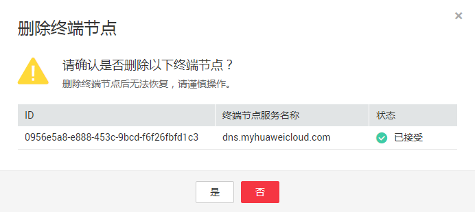

# 删除终端节点

## 操作场景

本节介绍如何删除终端节点。

> **说明：** 
>终端节点删除后无法恢复，请谨慎操作。

## 操作步骤

1.  登录管理控制台。
2.  在管理控制台左上角单击“”图标，选择区域和项目。
3.  单击“服务列表”中的“网络 \> VPC终端节点”，进入“终端节点”页面。
4.  在左侧导航栏选择“VPC终端节点 \> 终端节点”。
5.  单击待删除的终端节点所在行的“删除”按钮。

    **图 1**  删除终端节点  
    

6.  在弹出的对话框中单击“是”，删除终端节点。

