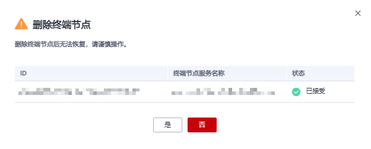

# 删除终端节点

## 操作场景

根据实际需求，删除终端节点。

## 操作步骤

1.  登录管理控制台。
2.  在管理控制台左上角单击图标，选择区域和项目。
3.  单击“服务列表”，选择“网络 \> VPC终端节点”，进入“VPC终端节点”页面。
4.  在左侧导航栏选择“VPC终端节点 \> 终端节点”。
5.  单击待删除的终端节点所在行的“删除”按钮。
6.  在弹出的对话框中单击“确定”。

    **图 1**  删除终端节点  
    

