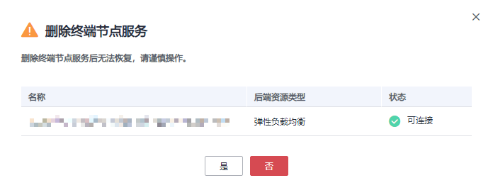

# 删除终端节点服务

## 操作场景

本节介绍如何删除终端节点服务。

> **说明：** 
>终端节点服务删除后无法恢复，请谨慎操作。

## 约束与限制

-   您只能删除由用户私有服务创建的终端节点服务，无权删除系统配置的终端节点服务。
-   当终端节点服务下存在状态为“已接受”、“创建中”的终端节点时，无法直接删除。

    终端节点服务下终端节点的状态，请参见[终端节点服务和终端节点有哪些状态？](https://support.huaweicloud.com/vpcep_faq/vpcep_04_0005.html)。

## 操作步骤

1.  登录管理控制台。
2.  在管理控制台左上角单击“”图标，选择区域和项目。

1.  单击“服务列表”中的“网络 \> VPC终端节点”，进入“终端节点”页面。

1.  在左侧导航栏选择“VPC终端节点 \> 终端节点服务”。
2.  单击待删除的终端节点服务所在行“操作”栏下的“删除”按钮。

    **图 1**  删除终端节点服务  
    

3.  在弹出的对话框中单击“是”，删除终端节点服务。

