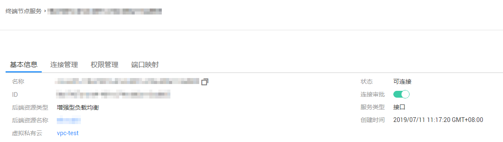

# 查看终端节点服务

## 操作场景

查看终端节点服务的名称、ID、后端资源类型、后端服务名称、虚拟私有云、状态、连接审批、服务类型、创建时间详细信息。

## 操作步骤

1.  登录管理控制台。
2.  在管理控制台左上角单击图标，选择区域和项目。
3.  单击“服务列表”中的“网络 \> VPC终端节点”，进入“终端节点”页面。
4.  在左侧导航栏选择“VPC终端节点 \> 终端节点服务”，进入“终端节点服务”页面。
5.  单击要查看的终端节点服务名称，您可以查看终端节点服务的基本信息。

    **图 1**  终端节点服务详情  
    

    终端节点服务详情包含“基本信息”、“连接管理”、“权限管理”以及“端口映射”等页签，其参数含义如[表1](#table11373229195910)所示。

    **表 1**  参数说明

    
    <table><thead align="left"><tr id="row123731829185916"><th class="cellrowborder" valign="top" width="21.09%" id="mcps1.2.4.1.1">
页签

    </th>
    <th class="cellrowborder" valign="top" width="29.849999999999998%" id="mcps1.2.4.1.2">
参数名称

    </th>
    <th class="cellrowborder" valign="top" width="49.059999999999995%" id="mcps1.2.4.1.3">
说明

    </th>
    </tr>
    </thead>
    <tbody><tr id="row6601518175912"><td class="cellrowborder" valign="top" width="21.09%" headers="mcps1.2.4.1.1 ">
基本信息

    </td>
    <td class="cellrowborder" valign="top" width="29.849999999999998%" headers="mcps1.2.4.1.2 ">
名称

    </td>
    <td class="cellrowborder" valign="top" width="49.059999999999995%" headers="mcps1.2.4.1.3 ">
终端节点服务名称。

    </td>
    </tr>
    <tr id="row6602718105914"><td class="cellrowborder" valign="top" width="21.09%" headers="mcps1.2.4.1.1 ">
基本信息

    </td>
    <td class="cellrowborder" valign="top" width="29.849999999999998%" headers="mcps1.2.4.1.2 ">
ID

    </td>
    <td class="cellrowborder" valign="top" width="49.059999999999995%" headers="mcps1.2.4.1.3 ">
终端节点服务ID。

    </td>
    </tr>
    <tr id="row1660320181596"><td class="cellrowborder" valign="top" width="21.09%" headers="mcps1.2.4.1.1 ">
基本信息

    </td>
    <td class="cellrowborder" valign="top" width="29.849999999999998%" headers="mcps1.2.4.1.2 ">
后端资源类型

    </td>
    <td class="cellrowborder" valign="top" width="49.059999999999995%" headers="mcps1.2.4.1.3 ">
提供服务的后端资源类型。

    </td>
    </tr>
    <tr id="row1260311185593"><td class="cellrowborder" valign="top" width="21.09%" headers="mcps1.2.4.1.1 ">
基本信息

    </td>
    <td class="cellrowborder" valign="top" width="29.849999999999998%" headers="mcps1.2.4.1.2 ">
后端资源名称

    </td>
    <td class="cellrowborder" valign="top" width="49.059999999999995%" headers="mcps1.2.4.1.3 ">
提供服务的后端资源名称。

    </td>
    </tr>
    <tr id="row1603161817598"><td class="cellrowborder" valign="top" width="21.09%" headers="mcps1.2.4.1.1 ">
基本信息

    </td>
    <td class="cellrowborder" valign="top" width="29.849999999999998%" headers="mcps1.2.4.1.2 ">
虚拟私有云

    </td>
    <td class="cellrowborder" valign="top" width="49.059999999999995%" headers="mcps1.2.4.1.3 ">
终端节点服务所属VPC。

    </td>
    </tr>
    <tr id="row9659329903"><td class="cellrowborder" valign="top" width="21.09%" headers="mcps1.2.4.1.1 ">
基本信息

    </td>
    <td class="cellrowborder" valign="top" width="29.849999999999998%" headers="mcps1.2.4.1.2 ">
状态

    </td>
    <td class="cellrowborder" valign="top" width="49.059999999999995%" headers="mcps1.2.4.1.3 ">
终端节点服务状态。

    </td>
    </tr>
    <tr id="row1465962910011"><td class="cellrowborder" valign="top" width="21.09%" headers="mcps1.2.4.1.1 ">
基本信息

    </td>
    <td class="cellrowborder" valign="top" width="29.849999999999998%" headers="mcps1.2.4.1.2 ">
连接审批

    </td>
    <td class="cellrowborder" valign="top" width="49.059999999999995%" headers="mcps1.2.4.1.3 ">
终端节点服务是否开启连接审批。

    </td>
    </tr>
    <tr id="row1865942911010"><td class="cellrowborder" valign="top" width="21.09%" headers="mcps1.2.4.1.1 ">
基本信息

    </td>
    <td class="cellrowborder" valign="top" width="29.849999999999998%" headers="mcps1.2.4.1.2 ">
服务类型

    </td>
    <td class="cellrowborder" valign="top" width="49.059999999999995%" headers="mcps1.2.4.1.3 ">
终端节点服务类型。

    </td>
    </tr>
    <tr id="row1665992916016"><td class="cellrowborder" valign="top" width="21.09%" headers="mcps1.2.4.1.1 ">
基本信息

    </td>
    <td class="cellrowborder" valign="top" width="29.849999999999998%" headers="mcps1.2.4.1.2 ">
创建时间

    </td>
    <td class="cellrowborder" valign="top" width="49.059999999999995%" headers="mcps1.2.4.1.3 ">
终端节点服务创建时间。

    </td>
    </tr>
    <tr id="row1373142925914"><td class="cellrowborder" valign="top" width="21.09%" headers="mcps1.2.4.1.1 ">
连接管理

    </td>
    <td class="cellrowborder" valign="top" width="29.849999999999998%" headers="mcps1.2.4.1.2 ">
终端节点ID

    </td>
    <td class="cellrowborder" valign="top" width="49.059999999999995%" headers="mcps1.2.4.1.3 ">
终端节点的ID。

    </td>
    </tr>
    <tr id="row1931215511014"><td class="cellrowborder" valign="top" width="21.09%" headers="mcps1.2.4.1.1 ">
连接管理

    </td>
    <td class="cellrowborder" valign="top" width="29.849999999999998%" headers="mcps1.2.4.1.2 ">
报文标识

    </td>
    <td class="cellrowborder" valign="top" width="49.059999999999995%" headers="mcps1.2.4.1.3 ">
终端节点ID的标识，用来识别是哪个终端节点。

    </td>
    </tr>
    <tr id="row1788517341318"><td class="cellrowborder" valign="top" width="21.09%" headers="mcps1.2.4.1.1 ">
连接管理

    </td>
    <td class="cellrowborder" valign="top" width="29.849999999999998%" headers="mcps1.2.4.1.2 ">
状态

    </td>
    <td class="cellrowborder" valign="top" width="49.059999999999995%" headers="mcps1.2.4.1.3 ">
终端节点的状态。

    
关于终端节点的各个状态，请查看<a href="https://support.huaweicloud.com/vpcep_faq/zh-cn_topic_0168836900.html" target="_blank" rel="noopener noreferrer">终端节点服务和终端节点有哪些状态？</a>。

    </td>
    </tr>
    <tr id="row194731557216"><td class="cellrowborder" valign="top" width="21.09%" headers="mcps1.2.4.1.1 ">
连接管理

    </td>
    <td class="cellrowborder" valign="top" width="29.849999999999998%" headers="mcps1.2.4.1.2 ">
拥有者

    </td>
    <td class="cellrowborder" valign="top" width="49.059999999999995%" headers="mcps1.2.4.1.3 ">
终端节点创建者的账号ID。

    </td>
    </tr>
    <tr id="row148914485317"><td class="cellrowborder" valign="top" width="21.09%" headers="mcps1.2.4.1.1 ">
连接管理

    </td>
    <td class="cellrowborder" valign="top" width="29.849999999999998%" headers="mcps1.2.4.1.2 ">
创建时间

    </td>
    <td class="cellrowborder" valign="top" width="49.059999999999995%" headers="mcps1.2.4.1.3 ">
终端节点的创建时间。

    </td>
    </tr>
    <tr id="row20920431747"><td class="cellrowborder" valign="top" width="21.09%" headers="mcps1.2.4.1.1 ">
连接管理

    </td>
    <td class="cellrowborder" valign="top" width="29.849999999999998%" headers="mcps1.2.4.1.2 ">
操作

    </td>
    <td class="cellrowborder" valign="top" width="49.059999999999995%" headers="mcps1.2.4.1.3 ">
终端节点服务对终端节点的连接审批，可选择“接受”或“拒绝”。

    </td>
    </tr>
    <tr id="row491115378110"><td class="cellrowborder" valign="top" width="21.09%" headers="mcps1.2.4.1.1 ">
权限管理

    </td>
    <td class="cellrowborder" valign="top" width="29.849999999999998%" headers="mcps1.2.4.1.2 ">
授权账号ID

    </td>
    <td class="cellrowborder" valign="top" width="49.059999999999995%" headers="mcps1.2.4.1.3 ">
连接访问终端节点的授权账号ID或者*。

    
若“账号ID”列为“*”，表示所有用户均可访问该终端节点服务。

    </td>
    </tr>
    <tr id="row163028403116"><td class="cellrowborder" valign="top" width="21.09%" headers="mcps1.2.4.1.1 ">
权限管理

    </td>
    <td class="cellrowborder" valign="top" width="29.849999999999998%" headers="mcps1.2.4.1.2 ">
操作

    </td>
    <td class="cellrowborder" valign="top" width="49.059999999999995%" headers="mcps1.2.4.1.3 ">
对连接访问终端节点的授权账号进行删除操作，用于将授权账号从白名单中删除。

    </td>
    </tr>
    <tr id="row109693491717"><td class="cellrowborder" valign="top" width="21.09%" headers="mcps1.2.4.1.1 ">
端口映射

    </td>
    <td class="cellrowborder" valign="top" width="29.849999999999998%" headers="mcps1.2.4.1.2 ">
协议

    </td>
    <td class="cellrowborder" valign="top" width="49.059999999999995%" headers="mcps1.2.4.1.3 ">
终端节点服务与终端节点进行通信支持的协议。

    </td>
    </tr>
    <tr id="row5121531413"><td class="cellrowborder" valign="top" width="21.09%" headers="mcps1.2.4.1.1 ">
端口映射

    </td>
    <td class="cellrowborder" valign="top" width="29.849999999999998%" headers="mcps1.2.4.1.2 ">
服务端口

    </td>
    <td class="cellrowborder" valign="top" width="49.059999999999995%" headers="mcps1.2.4.1.3 ">
终端节点服务提供服务的端口。

    </td>
    </tr>
    <tr id="row176299161224"><td class="cellrowborder" valign="top" width="21.09%" headers="mcps1.2.4.1.1 ">
端口映射

    </td>
    <td class="cellrowborder" valign="top" width="29.849999999999998%" headers="mcps1.2.4.1.2 ">
终端端口

    </td>
    <td class="cellrowborder" valign="top" width="49.059999999999995%" headers="mcps1.2.4.1.3 ">
终端节点访问终端节点服务的端口。

    </td>
    </tr>
    <tr id="row19273741417"><td class="cellrowborder" valign="top" width="21.09%" headers="mcps1.2.4.1.1 ">
标签

    </td>
    <td class="cellrowborder" valign="top" width="29.849999999999998%" headers="mcps1.2.4.1.2 ">
键

    </td>
    <td class="cellrowborder" valign="top" width="49.059999999999995%" headers="mcps1.2.4.1.3 ">
终端节点服务的标签“键”。

    </td>
    </tr>
    <tr id="row1283716140"><td class="cellrowborder" valign="top" width="21.09%" headers="mcps1.2.4.1.1 ">
标签

    </td>
    <td class="cellrowborder" valign="top" width="29.849999999999998%" headers="mcps1.2.4.1.2 ">
值

    </td>
    <td class="cellrowborder" valign="top" width="49.059999999999995%" headers="mcps1.2.4.1.3 ">
终端节点服务的标签“值”。

    </td>
    </tr>
    <tr id="row15298761416"><td class="cellrowborder" valign="top" width="21.09%" headers="mcps1.2.4.1.1 ">
标签

    </td>
    <td class="cellrowborder" valign="top" width="29.849999999999998%" headers="mcps1.2.4.1.2 ">
操作

    </td>
    <td class="cellrowborder" valign="top" width="49.059999999999995%" headers="mcps1.2.4.1.3 ">
对终端节点服务标签进行操作，可选择“编辑”或“删除”。

    </td>
    </tr>
    </tbody>
    </table>

