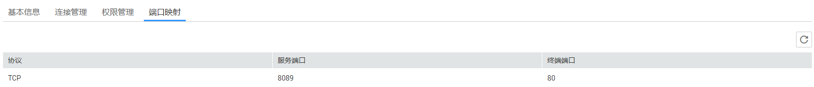

# 查看终端节点服务的端口映射

## 操作场景

当终端节点服务创建成功后，您可以查看已添加的端口映射。

端口映射定义了终端节点与终端节点服务之间通信所支持的协议及端口号，在创建终端节点服务时设置，包括：

-   协议：终端节点与终端节点服务支持的通信协议。
-   服务端口：终端节点服务绑定了后端资源，作为提供服务的端口。
-   终端端口：终端节点提供给用户，作为访问终端节点服务的端口。

## 操作步骤

1.  登录管理控制台。
2.  在管理控制台左上角单击“”图标，选择区域和项目。

1.  单击“服务列表”中的“网络 \> VPC终端节点”，进入“终端节点”页面。

1.  在左侧导航栏选择“VPC终端节点 \> 终端节点服务”。
2.  单击需要操作的终端节点服务。
3.  选择“端口映射”页签。

    可查看终端节点服务已设置的端口映射。

    **图 1**  端口映射  
    

