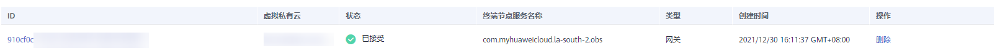
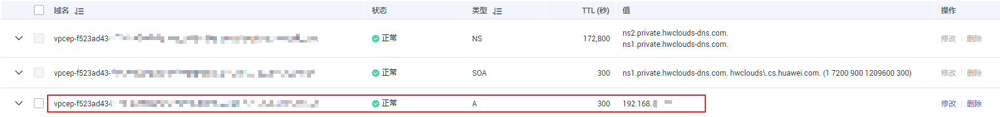

# 查询并访问终端节点

## 操作场景

当终端节点购买完成时，可以查询终端节点详情并访问终端节点。

## 查询终端节点

支持查询终端节点的ID、服务名称、虚拟私有云、状态等详情。

1.  登录管理控制台。
2.  在管理控制台左上角单击“”图标，选择区域和项目。

1.  单击“服务列表”，选择“网络 \> VPC终端节点”，进入“终端节点”页面。

    在终端节点列表右上角的过滤和搜索框可以快速定位终端节点：

    -   通过终端节点连接的终端节点服务名称或者终端节点ID进行搜索：
        1.  在过滤框中选择“终端节点服务名称”或者“ID”。
        2.  在搜索框中输入关键字。
        3.  单击“”开始搜索。

            搜索完成后，终端节点列表中显示包含关键字的终端节点。

    -   通过VPC终端节点预先设置的标签进行搜索：
        1.  在“标签搜索”中单击“”展开标签搜索区域。
        2.  输入标签“键”和“值”。

            直接输入或者在下拉框中选择标签的“键”和“值”。

            最多支持设置10组标签用于搜索终端节点。

        3.  单击“搜索”开始搜索。

            搜索完成后，终端节点列表中显示设置了指定标签的终端节点。

            若设置多组标签，则显示设置了所有指定标签的终端节点。

2.  单击要查看的终端节点ID，即可查看终端节点的基本信息。

    以接口型终端节点为例，创建成功后，会生成一个“节点IP”（即私有IP）和“内网域名”（如果在创建终端节点时您勾选了“创建内网域名”）。

    **图 1**  终端节点详情（接口）  
    

    **图 2**  终端节点详情（网关）  
    

    **表 1**  参数说明

    
    <table><thead align="left"><tr id="row123731829185916"><th class="cellrowborder" valign="top" width="21.09%" id="mcps1.2.4.1.1">
页签

    </th>
    <th class="cellrowborder" valign="top" width="29.849999999999998%" id="mcps1.2.4.1.2">
参数名称

    </th>
    <th class="cellrowborder" valign="top" width="49.059999999999995%" id="mcps1.2.4.1.3">
说明

    </th>
    </tr>
    </thead>
    <tbody><tr id="row6601518175912"><td class="cellrowborder" rowspan="9" valign="top" width="21.09%" headers="mcps1.2.4.1.1 ">
基本信息

    </td>
    <td class="cellrowborder" valign="top" width="29.849999999999998%" headers="mcps1.2.4.1.2 ">
ID

    </td>
    <td class="cellrowborder" valign="top" width="49.059999999999995%" headers="mcps1.2.4.1.3 ">
终端节点ID。

    </td>
    </tr>
    <tr id="row6602718105914"><td class="cellrowborder" valign="top" headers="mcps1.2.4.1.1 ">
虚拟私有云

    </td>
    <td class="cellrowborder" valign="top" headers="mcps1.2.4.1.2 ">
终端节点所属VPC。

    </td>
    </tr>
    <tr id="row1660320181596"><td class="cellrowborder" valign="top" headers="mcps1.2.4.1.1 ">
终端节点服务名称

    </td>
    <td class="cellrowborder" valign="top" headers="mcps1.2.4.1.2 ">
终端节点所连接的终端节点服务名称。

    </td>
    </tr>
    <tr id="row1260311185593"><td class="cellrowborder" valign="top" headers="mcps1.2.4.1.1 ">
节点IP

    </td>
    <td class="cellrowborder" valign="top" headers="mcps1.2.4.1.2 ">
终端节点的IP地址。

    </td>
    </tr>
    <tr id="row1603161817598"><td class="cellrowborder" valign="top" headers="mcps1.2.4.1.1 ">
内网域名

    </td>
    <td class="cellrowborder" valign="top" headers="mcps1.2.4.1.2 ">
终端节点的内网域名。

    </td>
    </tr>
    <tr id="row9659329903"><td class="cellrowborder" valign="top" headers="mcps1.2.4.1.1 ">
状态

    </td>
    <td class="cellrowborder" valign="top" headers="mcps1.2.4.1.2 ">
终端节点状态。

    </td>
    </tr>
    <tr id="row1465962910011"><td class="cellrowborder" valign="top" headers="mcps1.2.4.1.1 ">
类型

    </td>
    <td class="cellrowborder" valign="top" headers="mcps1.2.4.1.2 ">
终端节点所连接的终端节点服务类型。

    </td>
    </tr>
    <tr id="row1865942911010"><td class="cellrowborder" valign="top" headers="mcps1.2.4.1.1 ">
创建时间

    </td>
    <td class="cellrowborder" valign="top" headers="mcps1.2.4.1.2 ">
终端节点的创建时间。

    </td>
    </tr>
    <tr id="row1179474792414"><td class="cellrowborder" valign="top" headers="mcps1.2.4.1.1 ">
访问控制

    </td>
    <td class="cellrowborder" valign="top" headers="mcps1.2.4.1.2 ">
用于开启或关闭是否通过白名单控制访问终端节点的IP。

    <ul id="ul1476194712819"><li>开启：只允许白名单列表中的IP访问终端节点。</li><li>关闭：允许任何IP访问终端节点。</li></ul>
    
 说明： 

仅在连接“接口”型终端节点服务的终端节点显示。

    

    </td>
    </tr>
    <tr id="row1327810271222"><td class="cellrowborder" rowspan="2" valign="top" width="21.09%" headers="mcps1.2.4.1.1 ">
访问控制

    </td>
    <td class="cellrowborder" valign="top" width="29.849999999999998%" headers="mcps1.2.4.1.2 ">
白名单地址

    </td>
    <td class="cellrowborder" valign="top" width="49.059999999999995%" headers="mcps1.2.4.1.3 ">
允许访问终端节点的IP。

    
 说明： 

“访问控制”页签仅在连接“接口”型终端节点服务的终端节点显示。

    

    </td>
    </tr>
    <tr id="row5180896318"><td class="cellrowborder" valign="top" headers="mcps1.2.4.1.1 ">
操作

    </td>
    <td class="cellrowborder" valign="top" headers="mcps1.2.4.1.2 ">
对允许访问终端节点的白名单地址进行操作，仅支持“删除”白名单地址。

    </td>
    </tr>
    <tr id="row12214192615588"><td class="cellrowborder" rowspan="5" valign="top" width="21.09%" headers="mcps1.2.4.1.1 ">
路由表

    </td>
    <td class="cellrowborder" valign="top" width="29.849999999999998%" headers="mcps1.2.4.1.2 ">
名称

    </td>
    <td class="cellrowborder" valign="top" width="49.059999999999995%" headers="mcps1.2.4.1.3 ">
路由表的名称。

    
 说明： 

“路由表”页签仅在开放区域可见，且仅在连接“网关”型终端节点服务的终端节点显示。

    

    </td>
    </tr>
    <tr id="row1224422919585"><td class="cellrowborder" valign="top" headers="mcps1.2.4.1.1 ">
虚拟私有云

    </td>
    <td class="cellrowborder" valign="top" headers="mcps1.2.4.1.2 ">
路由表所属VPC。

    </td>
    </tr>
    <tr id="row267955611586"><td class="cellrowborder" valign="top" headers="mcps1.2.4.1.1 ">
类型

    </td>
    <td class="cellrowborder" valign="top" headers="mcps1.2.4.1.2 ">
路由表的类型，包括“默认路由表”和“自定义路由表”。

    </td>
    </tr>
    <tr id="row4267144117219"><td class="cellrowborder" valign="top" headers="mcps1.2.4.1.1 ">
关联子网

    </td>
    <td class="cellrowborder" valign="top" headers="mcps1.2.4.1.2 ">
路由表的关联子网数量。

    </td>
    </tr>
    <tr id="row14328165417587"><td class="cellrowborder" valign="top" headers="mcps1.2.4.1.1 ">
操作

    </td>
    <td class="cellrowborder" valign="top" headers="mcps1.2.4.1.2 ">
对终端节点路由表进行操作，可选择“解绑”或“绑定”路由表。

    
 说明： 

当终端节点仅绑定一个路由表示，不支持“解绑”操作。

    

    </td>
    </tr>
    <tr id="row1262811653513"><td class="cellrowborder" rowspan="3" valign="top" width="21.09%" headers="mcps1.2.4.1.1 ">
标签

    </td>
    <td class="cellrowborder" valign="top" width="29.849999999999998%" headers="mcps1.2.4.1.2 ">
键

    </td>
    <td class="cellrowborder" valign="top" width="49.059999999999995%" headers="mcps1.2.4.1.3 ">
终端节点的标签“键”。

    </td>
    </tr>
    <tr id="row1468217176366"><td class="cellrowborder" valign="top" headers="mcps1.2.4.1.1 ">
值

    </td>
    <td class="cellrowborder" valign="top" headers="mcps1.2.4.1.2 ">
终端节点的标签“值”。

    </td>
    </tr>
    <tr id="row1791516293369"><td class="cellrowborder" valign="top" headers="mcps1.2.4.1.1 ">
操作

    </td>
    <td class="cellrowborder" valign="top" headers="mcps1.2.4.1.2 ">
对终端节点标签进行操作，可选择“编辑”或“删除”标签。

    </td>
    </tr>
    </tbody>
    </table>

## 访问终端节点（节点IP）

支持通过查询的终端节点的“节点IP”访问终端节点。

1.  在终端节点所属VPC内，登录该终端节点连接的后端资源，例如ECS。
2.  根据后端资源类型，选择不同的命令，通过以下格式访问终端节点：

    _命令 节点IP:端口_

    例如，后端资源为ECS，使用如下命令：

    **curl  _节点IP:端口_**

## 访问终端节点（内网域名）

当购买终端节点时勾选了“创建内网域名”时，支持通过查询终端节点的“内网域名”访问终端节点。

系统会自动将生成的“内网域名”添加至云解析服务中，并为该域名添加A类型记录集，实现内网域名到节点IP的解析。

您可以在云解析服务控制台查看内网域名及其解析记录。

**查看“内网域名”解析记录**

1.  登录管理控制台。
2.  将鼠标悬浮于页面左侧的“”，在服务列表中，选择“网络  \> 云解析服务”。

    进入“云解析”页面。

3.  在左侧树状导航栏，选择“域名解析 \> 内网解析”。

    进入“内网域名”页面。

1.  在“内网域名”页面的域名列表中，单击终端节点的“内网域名”的名称。

    进入“解析记录”页面。

2.  在解析记录列表中，可以查看到终端节点“内网域名”到“节点IP”的A类型记录集。

    当“状态”列显示为“正常”时，表示解析生效。

    **图 3**  “内网域名”解析记录  
    

**通过“内网域名”访问终端节点**

1.  在终端节点所属VPC内，登录该终端节点连接的后端资源，例如ECS。
2.  根据后端资源类型，选择不同的命令，通过以下格式访问终端节点：

    _命令 内网域名:端口_

    例如，后端资源为ECS，使用如下命令：

    **curl  _内网域名:端口_**

