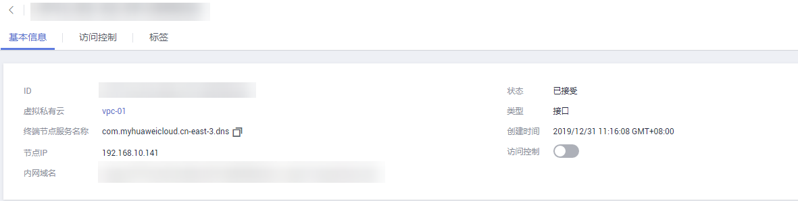

# 查询终端节点

## 操作场景

查看终端节点的ID、服务名称、虚拟私有云、状态等。

## 操作步骤

1.  登录管理控制台。
2.  在管理控制台左上角单击图标，选择区域和项目。
3.  单击“服务列表”，选择“网络 \> VPC终端节点”，进入“VPC终端节点”页面。
4.  在左侧导航栏选择“VPC终端节点 \> 终端节点”。
5.  单击，即可查看终端节点的详细信息如[图1](#zh-cn_topic_0162785419_fig49641514614)所示。

    **图 1**  终端节点详情  
    

