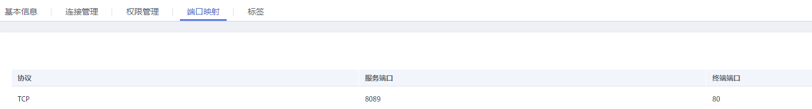

# 端口映射

## 操作场景

对已添加的端口映射进行展示。

## 操作步骤

1.  登录管理控制台。
2.  在管理控制台左上角单击图标，选择区域和项目。
3.  单击“服务列表”，选择“网络 \> VPC终端节点”，进入“VPC终端节点”页面。
4.  在左侧导航栏选择“VPC终端节点 \> 终端节点服务”。
5.  单击需要操作的终端节点服务。
6.  选择“端口映射”。

    显示所添加的端口映射。

    **图 1**  端口映射  
    

