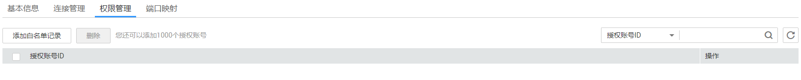
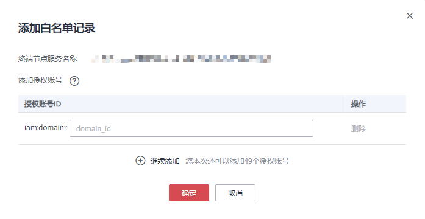

# 终端节点服务权限管理

## 操作场景

权限管理用于控制是否允许跨租户的终端节点连接终端节点服务。

在终端节点服务创建完成后，可以通过权限管理设置允许连接该终端节点服务的授权账号ID，支持将授权账号ID添加至白名单以及从白名单移除。

白名单用于在创建跨租户的终端节点时进行校验。

-   如果白名单为空，则不支持跨租户的终端节点连接终端节点服务。
-   如果某一账号包含在终端节点服务的白名单中，则可以通过该账号创建连接终端节点服务的终端节点。
-   如果某一账号未包含在终端节点服务的白名单中，则无法通过该账号创建连接终端节点服务的终端节点。

## 操作步骤

1.  登录管理控制台。
2.  在管理控制台左上角单击图标，选择区域和项目。
3.  单击“服务列表”，选择“网络 \> VPC终端节点”，进入“VPC终端节点”页面。
4.  在左侧导航栏选择“VPC终端节点 \> 终端节点服务”。
5.  单击需要操作的终端节点服务名称。
6.  选择“权限管理”。

    **图 1**  权限管理  
    

7.  单击“添加白名单记录”，根据提示配置参数，输入授权用户的账号ID，可添加白名单。

    **图 2**  添加白名单记录  
    

    > **说明：**   
    >-   本账号默认在自身账号的终端节点服务的白名单中。  
    >-   授权账号ID格式要正确：（iam:domain::domain\_id），例如iam:domain::1564ec50ef2a47c791ea5536353ed4b9。  
    >-   添加\*到白名单即为所有用户可访问  

8.  删除白名单。
    -   删除一个：单击对应授权账号ID“操作”栏下的“删除”。
    -   删除多个：选中需要删除的授权账号ID，单击上方的“删除”按钮。

