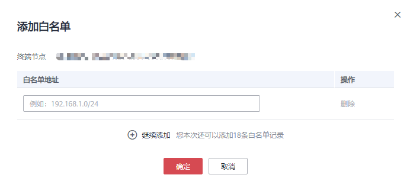

# 设置终端节点的访问控制

## 操作场景

终端节点的访问控制功能用于控制是否支持通过白名单设置允许访问终端节点的IP。在购买终端节点时以及购买完成后，均可以开启或关闭终端节点的访问控制功能，也可以添加或删除白名单。

> **说明：** 
>-   只有连接“接口”型终端节点服务的终端节点支持访问控制功能。
>-   如果关闭访问控制功能，表示允许任何IP访问终端节点。

购买终端节点时，如何设置访问控制和白名单，请参见[购买终端节点](购买终端节点.md)。

本节介绍在终端节点购买完成后，如何开启并设置访问控制功能。

## 开启访问控制并添加白名单

1.  登录管理控制台。
2.  在管理控制台左上角单击“”图标，选择区域和项目。

1.  单击“服务列表”中的“网络 \> VPC终端节点”，进入“终端节点”页面。

1.  在终端节点列表中，单击终端节点ID，进入终端节点“基本信息”页签。
2.  在“基本信息”页签，开启“访问控制”。
3.  在“访问控制”页签，单击“添加白名单”。

    **图 1**  添加终端节点白名单  
    

4.  在“白名单地址”列，输入允许访问终端节点的IP地址。

    > **说明：** 
    >最多支持添加60个白名单地址。

5.  单击“确定”，完成白名单地址的添加。

## 删除白名单地址

1.  登录管理控制台。
2.  在管理控制台左上角单击“”图标，选择区域和项目。

1.  单击“服务列表”中的“网络 \> VPC终端节点”，进入“终端节点”页面。

1.  在终端节点列表中，单击终端节点ID，进入终端节点“基本信息”页签。
2.  选择“访问控制”页签，显示终端节点的白名单列表。
3.  在白名单列表中，单击待删除白名单地址“操作”列的“删除”，删除该地址。

    如果要删除多个白名单地址，可以勾选待删除的白名单地址，单击上方的“删除”。

4.  在弹出的对话框中单击“是”，删除终端节点的白名单地址。

