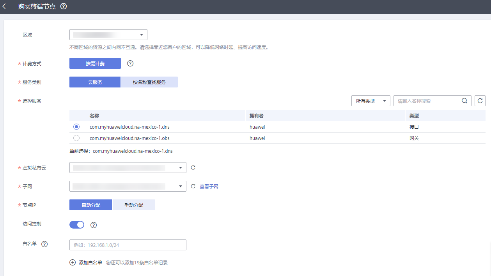

# 访问OBS<a name="vpcep_03_0300"></a>

## 操作场景<a name="section208321434111114"></a>

VPN、云专线线下节点通过终端节点高速访问OBS。

> **说明：** 
>仅“拉美-墨西哥城一”、“拉美-圣保罗一”和“拉美-圣地亚哥”区域支持将OBS配置为终端节点服务，因此本场景仅适用于这些区域。

## 前提条件<a name="section4151131713"></a>

您的本地数据中心已通过VPN或者云专线与VPC连通。

-   VPN连接对应的需要与本地数据中心互通的VPC子网网段，需包含OBS的网段100.125.0.0/16。

    创建虚拟专用网络，请参考[创建VPN网关](https://support.huaweicloud.com/qs-vpn/zh-cn_topic_0133627788.html)。

-   专线虚拟网关允许访问的VPC子网网段需包含OBS的网段100.125.0.0/16。

    开通云专线，请参考[开通云专线](https://support.huaweicloud.com/qs-dc/zh-cn_topic_0145790541.html)。


## 操作步骤<a name="section14475182616113"></a>

1.  在管理控制台左上角单击图标，选择区域和项目。
2.  在“服务列表”中，选择“网络 \> VPC终端节点”，进入终端节点页面。
3.  在左侧导航栏，选择“VPC终端节点 \> 终端节点”。
4.  <a name="li145571928161519"></a>在终端节点界面，单击“购买终端节点”，创建连接DNS服务的终端节点。
5.  选择“云服务 \> com.myhuaweicloud.na-mexico-1.dns”。
6.  根据界面提示配置参数，详细如[图1](#fig9987546115420)所示。

    **图 1**  购买终端节点（云服务-接口型）<a name="fig9987546115420"></a>  
    

7.  选择“立即购买 \> 提交”，完成创建。
8.  <a name="li688862223218"></a>查看连接DNS服务的终端节点创建完成后返回的节点IP。
9.  在用户线下的DNS服务器配置相应的DNS转发规则，将解析OBS域名的请求转发到DNS终端节点。

    以常见的DNS软件Bind为例：

    方式1：在/etc/named.conf内，增加DNS转发器的配置，forwarders为DNS终端节点IP地址。

    ```
    options {
            forward only；
            forwarders{ xx.xx.xx.xx;};
    };
    ```

    方式2：在/etc/named.rfc1912.zones文件，增加如下内容，forwarders为DNS终端节点IP地址。

    以“拉美-墨西哥城一”的OBS Endpoint为例：

    ```
    zone "com.myhuaweicloud.na-mexico-1.obs" {
            type forward;
            forward only;
            forwarders{ xx.xx.xx.xx;};
    };
    ```

    > **说明：** 
    >-   线下若无DNS服务器，需要通过增加DNS终端节点IP地址到线下节点的/etc/resolv.conf文件中。
    >-   xx.xx.xx.xx为步骤[9](#li688862223218)中的节点IP。

10. 配置线下节点到专线网关或VPN网关的DNS路由。

    DNS终端节点IP的IP地址为xx.xx.xx.xx，所以需要将节点访问DNS的流量指向线下专线网关或VPN网关，然后走专线或VPN访问OBS。在线下节点配置永久路由，指定访问OBS的流量下一跳为线下专线网关或VPN网关的IP地址。

    route -p add xx.xx.xx.xx mask 255.255.255.255 xxx.xxx.xxx.xxx

    > **说明：** 
    >-   xx.xx.xx.xx为步骤[9](#li688862223218)中的节点IP。
    >-   xxx.xxx.xxx.xxx为线下专线网关或VPN网关的IP地址。

11. 参考步骤[5](#li145571928161519)到[9](#li688862223218)，创建连接OBS服务的终端节点。

    > **说明：** 
    >线下节点只能访问终端节点所在区域对应的OBS域名地址。

12. 配置线下节点到专线网关或VPN网关的OBS路由。

    线上OBS的IP地址网段为100.125.0.0/16，所以需要将节点访问OBS的流量指向线下专线网关或VPN网关，然后走专线或VPN访问OBS。

    在线下节点配置永久路由，指定访问OBS的流量下一跳为线下专线网关或VPN网关的IP地址。

    ```
    route -p add 100.125.0.0 mask 255.255.0.0 xxx.xxx.xxx.xxx
    ```

    > **说明：** 
    >如果线下节点和线下专线网关或VPN网关网络不通，需要预先打通之间的网络。


