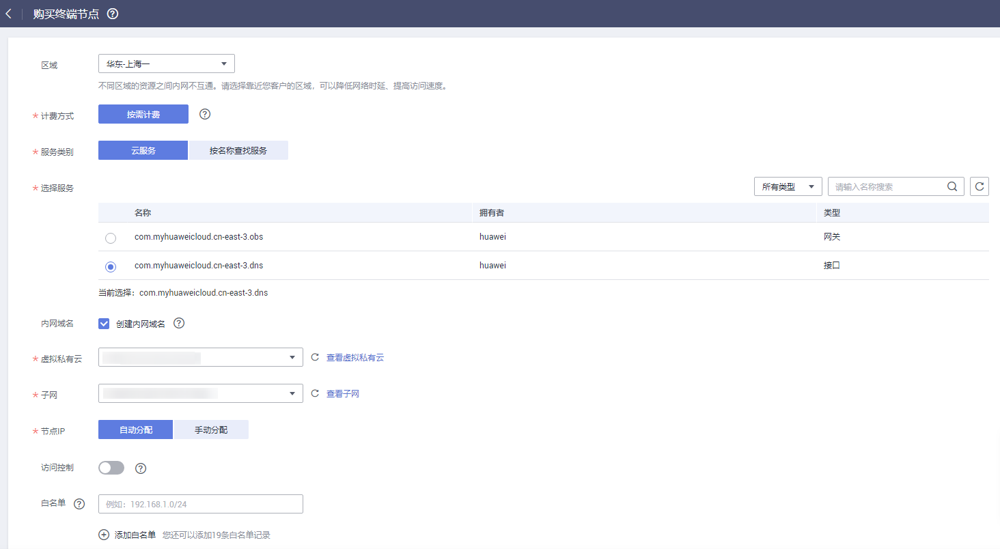

# 购买终端节点

## 操作场景

根据实际需求，购买终端节点。

## 操作步骤

1.  登录管理控制台。
2.  在管理控制台左上角单击图标，选择区域和项目。
3.  单击“服务列表”中的“网络 \> VPC终端节点”，进入“终端节点”页面。
4.  在左侧导航栏选择“VPC 终端节点 \> 终端节点”，进入“终端节点”页面。
5.  在“终端节点”页面，单击“购买终端节点”，进入“购买终端节点”页面。
6.  在“购买终端节点”页面，根据提示配置参数。

    **图 1**  购买终端节点1  
    

    购买终端节点请参考[表1 终端节点配置参数](#table12737165517587)。

    **表 1**  终端节点配置参数

    
    <table><thead align="left"><tr id="row573718559589"><th class="cellrowborder" valign="top" width="19.950000000000003%" id="mcps1.2.3.1.1">
参数

    </th>
    <th class="cellrowborder" valign="top" width="80.05%" id="mcps1.2.3.1.2">
说明

    </th>
    </tr>
    </thead>
    <tbody><tr id="row157371055185814"><td class="cellrowborder" valign="top" width="19.950000000000003%" headers="mcps1.2.3.1.1 ">
区域

    </td>
    <td class="cellrowborder" valign="top" width="80.05%" headers="mcps1.2.3.1.2 ">
终端节点所在区域。不同区域的资源之间内网不互通。请选择靠近您的区域，可以降低网络时延、提高访问速度。

    </td>
    </tr>
    <tr id="row16737195545812"><td class="cellrowborder" valign="top" width="19.950000000000003%" headers="mcps1.2.3.1.1 ">
计费方式

    </td>
    <td class="cellrowborder" valign="top" width="80.05%" headers="mcps1.2.3.1.2 ">
按需计费是后付费模式，按终端节点服务的实际使用时长计费，可以随时开通/删除终端节点服务。

    
仅支持按需计费。

    </td>
    </tr>
    <tr id="row1173785555810"><td class="cellrowborder" valign="top" width="19.950000000000003%" headers="mcps1.2.3.1.1 ">
服务类别

    </td>
    <td class="cellrowborder" valign="top" width="80.05%" headers="mcps1.2.3.1.2 ">
可选择“云服务”或“按名称查找服务”。

    <ul id="ul462316111449"><li>云服务：当您要连接的终端节点服务为云服务时，需要选择“云服务”。</li><li>按名称查找服务：当您要连接的终端节点服务为用户私有服务时，需要选择“按名称查找服务”。</li></ul>
    </td>
    </tr>
    <tr id="row680485252415"><td class="cellrowborder" valign="top" width="19.950000000000003%" headers="mcps1.2.3.1.1 ">
选择服务

    </td>
    <td class="cellrowborder" valign="top" width="80.05%" headers="mcps1.2.3.1.2 ">
若“服务类别”选择“云服务”，则会出现该参数。

    
终端节点服务实例已由运维人员预先创建完成，您可以直接使用。

    </td>
    </tr>
    <tr id="row181111619152517"><td class="cellrowborder" valign="top" width="19.950000000000003%" headers="mcps1.2.3.1.1 ">
服务名称

    </td>
    <td class="cellrowborder" valign="top" width="80.05%" headers="mcps1.2.3.1.2 ">
若“服务类别”选择“按名称查找服务”，则会出现该参数。

    
输入终端节点服务名称，单击“验证”：

    <ul id="ul2413202710255"><li>若显示“已找到服务”，继续后续操作。</li><li>若显示“未找到服务”，请检查“区域”是否和终端节点服务所在区域一致或输入的“服务名称”是否正确。</li></ul>
    </td>
    </tr>
    <tr id="row1762717911591"><td class="cellrowborder" valign="top" width="19.950000000000003%" headers="mcps1.2.3.1.1 ">
内网域名

    </td>
    <td class="cellrowborder" valign="top" width="80.05%" headers="mcps1.2.3.1.2 ">
如果您想要以域名的方式访问终端节点，则选择“创建内网域名”，终端节点创建完成后，即可通过内网域名直接访问终端节点。

    
接口终端节点才需在页面设置此选项。

    <ul id="ul48541540116"><li>终端节点服务的类型为“网关”时，无需创建内网域名；</li><li>终端节点服务的类型为“接口”时，可选择是否创建内网域名。</li></ul>
    </td>
    </tr>
    <tr id="row36294912590"><td class="cellrowborder" valign="top" width="19.950000000000003%" headers="mcps1.2.3.1.1 ">
虚拟私有云

    </td>
    <td class="cellrowborder" valign="top" width="80.05%" headers="mcps1.2.3.1.2 ">
选择终端节点所属的虚拟私有云。

    </td>
    </tr>
    <tr id="row1062914915592"><td class="cellrowborder" valign="top" width="19.950000000000003%" headers="mcps1.2.3.1.1 ">
子网

    </td>
    <td class="cellrowborder" valign="top" width="80.05%" headers="mcps1.2.3.1.2 ">
当创建连接“接口”类型终端节点服务的终端节点时，则会出现该参数。

    
选择终端节点所属的子网。

    </td>
    </tr>
    <tr id="row9984356166"><td class="cellrowborder" valign="top" width="19.950000000000003%" headers="mcps1.2.3.1.1 ">
节点IP

    </td>
    <td class="cellrowborder" valign="top" width="80.05%" headers="mcps1.2.3.1.2 ">
当创建连接“接口”类型终端节点服务的终端节点时，则会出现该参数。

    
终端节点的私网IP。可选择“自动分配”或“手动分配”。

    </td>
    </tr>
    <tr id="row374813288719"><td class="cellrowborder" valign="top" width="19.950000000000003%" headers="mcps1.2.3.1.1 ">
访问控制

    </td>
    <td class="cellrowborder" valign="top" width="80.05%" headers="mcps1.2.3.1.2 ">
当创建连接“接口”类型终端节点服务的终端节点时，则会出现该参数。

    
用于设置允许访问终端节点的IP。

    <ul id="ul4388191416510"><li>开启：只允许白名单列表中的IP访问终端节点。</li><li>关闭：允许任何IP访问终端节点。</li></ul>
    </td>
    </tr>
    <tr id="row6869163010717"><td class="cellrowborder" valign="top" width="19.950000000000003%" headers="mcps1.2.3.1.1 ">
白名单

    </td>
    <td class="cellrowborder" valign="top" width="80.05%" headers="mcps1.2.3.1.2 ">
当创建连接“接口”类型终端节点服务的终端节点时，则会出现该参数。

    
用于设置允许访问的IP地址或网段，最多支持添加20个记录。

    </td>
    </tr>
    <tr id="row97339612382"><td class="cellrowborder" valign="top" width="19.950000000000003%" headers="mcps1.2.3.1.1 ">
路由表

    </td>
    <td class="cellrowborder" valign="top" width="80.05%" headers="mcps1.2.3.1.2 ">
当创建连接“网关”类型终端节点服务的终端节点时，则会出现该参数。

    
根据实际需求选择终端节点所属的虚拟私有云的路由表。

    
添加路由的详细操作请参考《虚拟私有云用户指南》中的“<a href="https://support.huaweicloud.com/usermanual-vpc/vpc_route_0006.html" target="_blank" rel="noopener noreferrer">添加自定义路由</a>”。

    </td>
    </tr>
    <tr id="row1164684404011"><td class="cellrowborder" valign="top" width="19.950000000000003%" headers="mcps1.2.3.1.1 ">
标签

    </td>
    <td class="cellrowborder" valign="top" width="80.05%" headers="mcps1.2.3.1.2 ">
可选参数。

    
终端节点的标示，包括键和值。可以为终端节点创建10个标签。

    
标签的命名规则请参考<a href="#table37259471306">表2</a>。

    
 说明： 

如果已经通过TMS的预定义标签功能预先创建了标签，则可以直接选择对应的标签键和值。

    
预定义标签的详细内容，请参见<a href="https://support.huaweicloud.com/usermanual-tms/zh-cn_topic_0056266269.html" target="_blank" rel="noopener noreferrer">预定义标签简介</a>。

    

    </td>
    </tr>
    </tbody>
    </table>

    **表 2**  终端节点标签命名规则

    
    <table><thead align="left"><tr id="zh-cn_topic_0162785419_row1975492119112"><th class="cellrowborder" valign="top" width="42.63%" id="mcps1.2.3.1.1">
参数

    </th>
    <th class="cellrowborder" valign="top" width="57.37%" id="mcps1.2.3.1.2">
规则

    </th>
    </tr>
    </thead>
    <tbody><tr id="zh-cn_topic_0162785419_row1375419211915"><td class="cellrowborder" valign="top" width="42.63%" headers="mcps1.2.3.1.1 ">
键

    </td>
    <td class="cellrowborder" valign="top" width="57.37%" headers="mcps1.2.3.1.2 "><ul id="zh-cn_topic_0162785419_ul182248574315"><li>不能为空。</li><li>对于同一终端节点键值唯一。</li><li>长度不超过36个字符，只能包含以下几种字符：<ul id="zh-cn_topic_0162785419_ul15224957937"><li>大写字母</li><li>小写字母</li><li>数字</li><li>特殊字符，包括“-”和“_”</li></ul>
    </li></ul>
    </td>
    </tr>
    <tr id="zh-cn_topic_0162785419_row97543211410"><td class="cellrowborder" valign="top" width="42.63%" headers="mcps1.2.3.1.1 ">
值

    </td>
    <td class="cellrowborder" valign="top" width="57.37%" headers="mcps1.2.3.1.2 ">
长度不超过43个字符，只能包含以下几种字符：<ul id="zh-cn_topic_0162785419_ul19120173116418"><li>大写字母</li><li>小写字母</li><li>数字</li><li>特殊字符，包括“-”和“_”</li></ul>
    

    </td>
    </tr>
    </tbody>
    </table>

7.  参数配置完成，单击“立即购买”，进行规格确认。
    -   规格确认无误，单击“提交”，任务提交成功。
    -   参数信息配置有误，需要修改，单击“上一步”，修改参数，然后单击“提交”。

