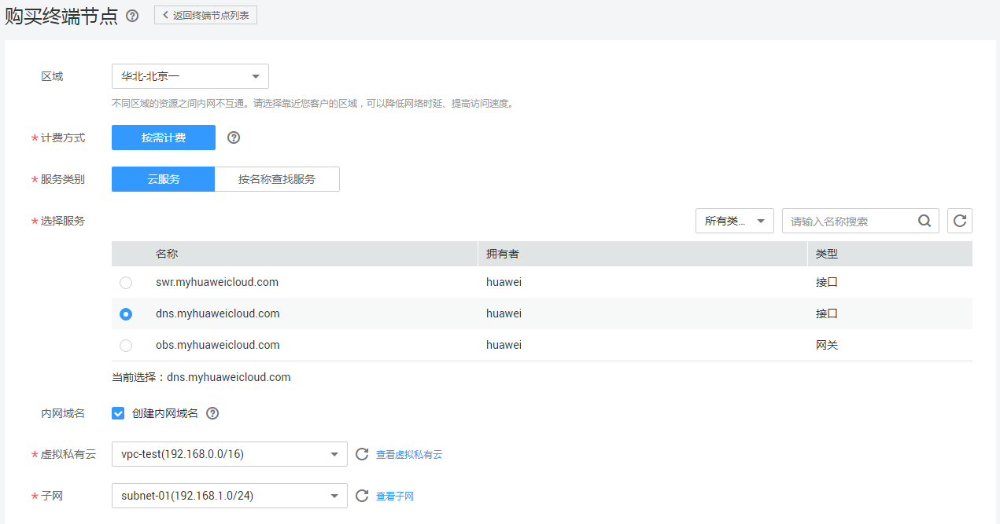

# 购买终端节点

## 操作场景

根据实际需求，购买终端节点。

## 操作步骤

1.  登录管理控制台。
2.  在管理控制台左上角单击图标，选择区域和项目。
3.  单击“服务列表”中的“网络 \> VPC终端节点”，进入“终端节点”页面。
4.  在左侧导航栏选择“VPC 终端节点 \> 终端节点”，进入“终端节点”页面。
5.  在“终端节点”页面，单击“购买终端节点”，进入“购买终端节点”页面。
6.  在“购买终端节点”页面，根据提示配置参数。

    **图 1**  购买终端节点  
    

    购买终端节点请参考[表1 终端节点配置参数](#table12737165517587)。

    **表 1**  终端节点配置参数

    
    <table><thead align="left"><tr id="row573718559589"><th class="cellrowborder" valign="top" width="19.950000000000003%" id="mcps1.2.3.1.1">
参数

    </th>
    <th class="cellrowborder" valign="top" width="80.05%" id="mcps1.2.3.1.2">
说明

    </th>
    </tr>
    </thead>
    <tbody><tr id="row157371055185814"><td class="cellrowborder" valign="top" width="19.950000000000003%" headers="mcps1.2.3.1.1 ">
区域

    </td>
    <td class="cellrowborder" valign="top" width="80.05%" headers="mcps1.2.3.1.2 ">
终端节点所在区域。

    
不同区域的资源之间内网不互通。请选择靠近您的区域，可以降低网络时延、提高访问速度。

    </td>
    </tr>
    <tr id="row1173785555810"><td class="cellrowborder" valign="top" width="19.950000000000003%" headers="mcps1.2.3.1.1 ">
服务类别

    </td>
    <td class="cellrowborder" valign="top" width="80.05%" headers="mcps1.2.3.1.2 ">
可选择“云服务”或“按名称查找服务”。

    <ul id="ul462316111449"><li>云服务：当您要连接的终端节点服务为云服务时，需要选择“云服务”。</li><li>按名称查找服务：当您要连接的终端节点服务为用户私有服务时，需要选择“按名称查找服务”。</li></ul>
    </td>
    </tr>
    <tr id="row680485252415"><td class="cellrowborder" valign="top" width="19.950000000000003%" headers="mcps1.2.3.1.1 ">
选择服务

    </td>
    <td class="cellrowborder" valign="top" width="80.05%" headers="mcps1.2.3.1.2 ">
若“服务类别”选择“云服务”，则会出现该参数。

    
终端节点服务实例已由运维人员预先创建完成，您可以直接使用。

    </td>
    </tr>
    <tr id="row181111619152517"><td class="cellrowborder" valign="top" width="19.950000000000003%" headers="mcps1.2.3.1.1 ">
服务名称

    </td>
    <td class="cellrowborder" valign="top" width="80.05%" headers="mcps1.2.3.1.2 ">
若“服务类别”选择“按名称查找服务”，则会出现该参数。

    
输入终端节点服务名称，单击“验证”：

    <ul id="ul2413202710255"><li>若显示“已找到服务”，继续后续操作。</li><li>若显示“未找到服务”，请检查“区域”是否和终端节点服务所在区域一致或输入的“服务名称”是否正确。</li></ul>
    </td>
    </tr>
    <tr id="row1762717911591"><td class="cellrowborder" valign="top" width="19.950000000000003%" headers="mcps1.2.3.1.1 ">
内网域名

    </td>
    <td class="cellrowborder" valign="top" width="80.05%" headers="mcps1.2.3.1.2 ">
如果您想要以域名的方式访问终端节点，则选择“创建内网域名”，终端节点创建完成后，即可通过内网域名直接访问终端节点。

    
接口终端节点才需在页面设置此选项。

    <ul id="ul48541540116"><li>终端节点服务的类型为“网关”时，无需创建内网域名；</li><li>终端节点服务的类型为“接口”时，可选择是否创建内网域名。</li></ul>
    </td>
    </tr>
    <tr id="row36294912590"><td class="cellrowborder" valign="top" width="19.950000000000003%" headers="mcps1.2.3.1.1 ">
虚拟私有云

    </td>
    <td class="cellrowborder" valign="top" width="80.05%" headers="mcps1.2.3.1.2 ">
选择终端节点所属的虚拟私有云。

    </td>
    </tr>
    <tr id="row1062914915592"><td class="cellrowborder" valign="top" width="19.950000000000003%" headers="mcps1.2.3.1.1 ">
子网

    </td>
    <td class="cellrowborder" valign="top" width="80.05%" headers="mcps1.2.3.1.2 ">
当创建连接“接口”类型终端节点服务的终端节点时，则会出现该参数。

    
选择终端节点所属的子网。

    </td>
    </tr>
    </tbody>
    </table>

7.  参数配置完成，单击“立即购买”，进行规格确认。
    -   规格确认无误，单击“提交”，任务提交成功。
    -   参数信息配置有误，需要修改，单击“上一步”，修改参数，然后单击“提交”。

