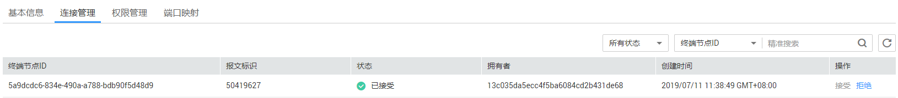

# 连接管理

## 操作场景

当您创建终端节点服务时选择了连接审批的功能，终端节点要与该终端节点服务进行连接，需要进行审批，审批权由终端节点服务控制。

终端节点服务可以选择接受或拒绝终端节点的访问。

## 操作步骤

1.  登录管理控制台。
2.  在管理控制台左上角单击图标，选择区域和项目。
3.  单击“服务列表”，选择“网络 \> VPC终端节点”，进入“VPC终端节点”页面。
4.  在左侧导航栏选择“VPC终端节点 \> 终端节点服务”。
5.  单击需要操作的终端节点服务名称。
6.  选择“连接管理”。

    **图 1**  连接管理  
    

7.  根据实际需求，对列表中的连接审批进行“接受”或“拒绝”操作。

